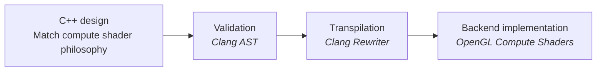
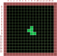
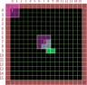
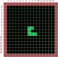

<style>
.container{
display:flex;
}
.col{
flex:1;
}

pre  {
  font-size: 12pt;
  line-height: 1;
}
</style>


---
# Introduction

* Koen Samyn
   * Program coordinator Game Development at Digital Arts and Entertainment (Belgium)
   * Programming generalist 
   * Educator: C++ / Python / Math / Graphics programming
* Goal: Show how pure C++20 can target GPU compute
---
# Contents
* Rationale behind the project
* Design goals
* Workflow with llvm and clang
* Meta programming
* Specific GLSL constructs: buffers, images, uniform, swizzles.
* Demos: Game of Life, Raytracer
---
# Why this project?
* Mental load to develop compute shaders is heavy
    * Still developing C++ skills.
    * Management layer needed for GPU resources.
    * Debugging GPU programs is hard.
* Programming model is different 
    * Workgroups / threads
    * Homogeneous parallelism: every thread performs the same task
    * Existing C++ code can be hard to convert
* Goal
    * Connect existing C++ skills (threading model) with GPU programming skills.
---
# Is this new?
* A lof of movement in this area and existing frameworks
    * CUDA /HIP
    * OpenCL
    * CompuShady (Python)
* Niche I am trying to fill:
    * Non-proprietary
    * Lightweight
    * Educational focus: teach transferable skills.
---
# Design goals
* Start with C++20 --> no new keywords 
* Transpile C++ code into GLSL
* Execution backend for CPU and GPU (OpenGL compute shaders)
* Make it easier to manage typical GPU resources: buffers, images, uniform variables
* Debug on CPU -> Test on GPU with a change of backend.
* Support for swizzle syntax 
* Compact code 

---
# Overview


---
# Game of Life case study
<div class="container">
<div class="col">

* From quadruple for loop to compute shader
* Rules for game of life:
    * Any cell with 3 neighbours 
    --> stays alive or is born
    * A live cell with 2 neighbours 
    --> stays alive
    * Any other case --> cell dies

</div>
<div class="col">

* Example: R-pentamino

</div>
</div>

---

# Game of Life case study

<div class="container">
<div class="col">

## State 0


</div>
<div class="col">

## State 1 calculation


</div>
</div>

---

# Game of Life case study

<div class="container">
<div class="col">

## State 0


</div>
<div class="col">

## State 1 


</div>
</div>

---

# Game of Life setup

``` cpp
int main()
{
  // setup
  const int pad = 1; // border
  const int width = 16;
  const int height = 16;
  // to replace with std::mdspan (C++23,26)
  std::array<std::array<uint32_t, width + 2 * pad>, height + 2 * pad> state0{};
  std::array<std::array<uint32_t, width + 2 * pad>, height + 2 * pad> state1{};

  state0[7][8] = 1;
  state0[8][7] = 1;
  state0[8][8] = 1;
  state0[9][8] = 1;
  state0[9][9] = 1;
}
```
---
# Calculate the next state

<div class="container">
<div class="col">

Job A: iteration
``` cpp
using index = ptrdiff_t;
for (index r = 0; r < height; ++r)
{
	for (index c = 0; c < width; ++c)
	{
``` 
Job B : Task / Thread
``` cpp
      index pr = r + pad;
      index pc = c + pad;
      int  n = 0;
      int alive = state0.at(pr).at(pc);
      // convolution
      for (index dy = -1; dy <= 1; ++dy)
      {
        for (index dx = -1; dx <= 1; ++dx)
        {
          if (dy || dx) {
            n += state0.at(pr + dy).at(pc + dx);
          }
        }
      }
      state1.at(pr).at(pc) = (n == 3) || (alive && n == 2);
```
</div>
<div class="col">

Job A : end iteration
``` cpp
	}
}
```
</div>
</div>
